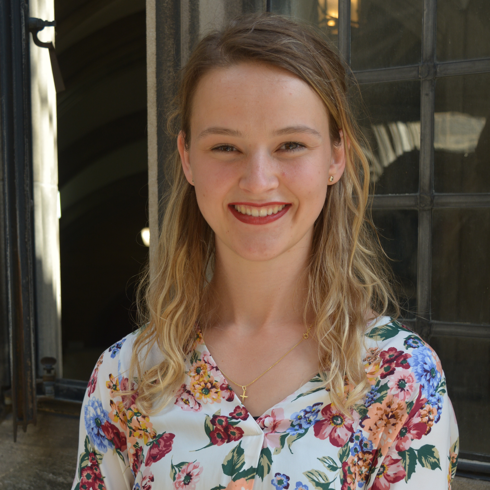

  

    <h1>About Me</h1>
    

Hi! I'm Evianne Rovers and welcome to my personal webspace. Recently, I graduated from University of Toronto with a PhD in Pharmacology (Computational Drug Discovery). I have worked under the supervision of Dr. Matthieu Schapira at the Structural Genomics Consortium where I have developed computational approaches for proximity pharmacology (PROTACs and other related modalities). 
    

  

  

    
  

  

    During my PhD, I developed a database that identifies potential novel starting points in various post-translational modifying enzymes for the design of new proximity-inducing chimeras (e.g., PHICs, PhosRCs, DUBTACs, etc.) and the database is publically available: <a href="[/eviannerovers/projects](https://polymorph.sgc.utoronto.ca/proxybind/)" target="_blank">ProxyBind database</a>. I also benchmarked multiple PROTAC virtual screening methods and binary complex prediction tools for their ability to predict PROTAC ternary complexes accurately and rank them correctly. This work is published (<a href="[/eviannerovers/projects](https://pubs.acs.org/doi/10.1021/acs.jcim.4c00426)" target="_blank">link</a>). As my last project, I have developed a adaptive sampling strategy based on k-Nearest Neighbour graph (called k-NNAS) to efficiently explore conformational space. This algorithm is very light and simple, so could be implemented easily in pipelines. This work is in preprint (<a href="[/eviannerovers/projects](https://www.biorxiv.org/content/10.1101/2025.03.05.641673v1)" target="_blank">link</a>) and the github for the benchmark experiments can be found <a href="[/eviannerovers/projects](https://github.com/ERovers/kNN-AS)" target="_blank">here</a>. I'm currently developing a pipeline to use k-NNAS to explore the PROTAC ternary complex conformational space using a convolutional variational autoencoder to describe the conformational landscape, this work can be found <a href="[/eviannerovers/projects](https://github.com/ERovers/knnsampling)" target="_blank">here</a>. At the SGC, I have worked with experimentalist to model different processes in drug discovery from small molecule docking to mutagenesis analysis to disrupt protein-protein complexes.
  

  

Recently, I started an research internship at the Vector Institute in the group of Dr. Chris Maddison (<a href="[/eviannerovers/phdthesis](https://www.cs.toronto.edu/~cmaddis/research.html)" target="_blank">link</a>). I'm developing code to run energy calculations on solvent systems (e.g. protein in water bath) and to convert cartesian coordinates into internal coordinates and back using JAX. These functions will enable the evaluation of variational sampling techniques for modeling energy landscapes of small molecules, proteins, or complexes in solvent environments.
    

    

Feel free to scope my <a href="/eviannerovers/cv" target="_blank">CV</a>, to learn more about my <a href="/eviannerovers/phdthesis" target="_blank">PhD thesis</a> work, to take a look at my other <a href="/eviannerovers/publications" target="_blank">publications</a> or to try some of code described at my <a href="/eviannerovers/projects" target="_blank">github</a> page.
    

    
    <h2>Personal background</h2>
    

I graduated with distinction from Amsterdam University College, earning a B.Sc. in Liberal Arts and Sciences. My majors focussed on Biomedical Sciences, Pharmacology and Chemistry. During my PhD, I have played for UofT's Varsity Women's Field Hockey team and served as captain for 3 years. Further, I enjoy travelling and hiking/mountaineering, so I grab every opportunity to scale a mountain. 
    

    

Also, open to chat about science, collaboration, or interesting opportunities!
Feel free to <a href="/eviannerovers/contact" target="_blank">contact me</a>
    

